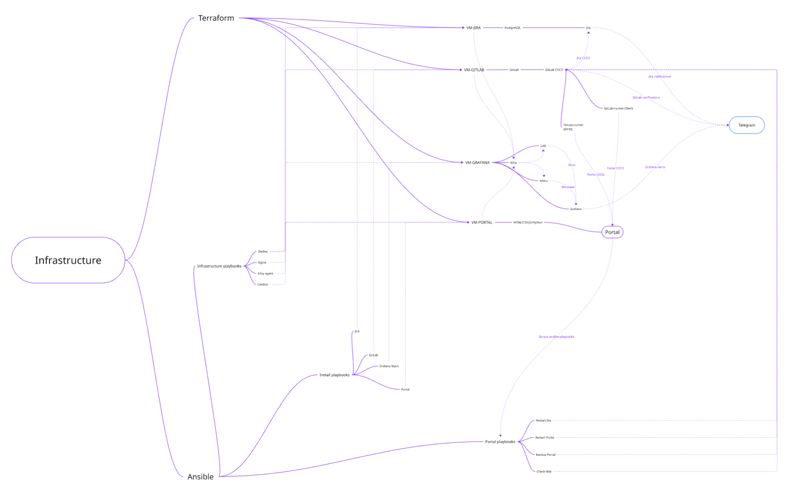

# 🎓 Дипломный проект — DevOps

## 📌 Описание проекта
Дипломный проект посвящён разработке и развертыванию портала с админ-панелью и связанных сервисов с применением DevOps-подхода.
Цель — автоматизировать процессы доставки приложений, управления инфраструктурой и мониторинга.

## 🧩 Архитектура
Проект построен на модульной архитектуре и включает следующие компоненты:

- **VCS**: GitLab
- **CI/CD**: GitLab CI/CD + Gitlab Runner (Docker-in-Docker — для сборки образов, Shell — для деплоя на сервер)
- **IaC**: Terraform, Ansible
- **Контейнеризация**: Docker
- **Веб-приложение**: Python Flask, HTML + CSS + JS
- **Мониторинг**: Grafana, Mimir, Alloy
- **Логирование**: Grafana, Loki, Alloy
- **Веб-сервер**: Nginx
- **Уведомления**: Telegram Bot
- **ОС**: Ubuntu 24.04.3 LTS
- **Языки программирования**: Bash, Python, YAML
- **Облачная платформа**: Yandex Cloud
- **База данных**: PostgreSQL
- **Бэкапы**: rsync, cp, tar, pg_dump

---

## 📋 Список виртуальных машин

| VM          | Назначение                | DNS / IP           | Основные сервисы |
|-------------|---------------------------|----------------------------|------------------|
| **vm-gitlab**   | GitLab CI/CD          | `gitlab.feebee.ru`         | GitLab CE, GitLab Runner |
| **vm-portal**   | Веб-приложение (Python Flask)    | `portal.feebee.ru`         | Python Flask, Nginx |
| **vm-grafana**  | Мониторинг и логирование  | `grafana.feebee.ru`        | Grafana, Mimir, Loki, Alloy |
| **vm-jira**     | Jira + PostgreSQL         | `jira.feebee.ru` | Atlassian Jira DC, PostgreSQL |

---

## 🚀 Инструкция по развертыванию

### 1. Подготовка окружения
1. Развернуть облачную инфраструктуру с помощью Terraform (Yandex Cloud).
2. Запустить плейбуки Ansible для установки на все ВМ docker, nginx+certbot, alloy-agents.

### 2. Настройка сервисов
1. Установить и настроить основные сервисы через Ansible:
* Jira Data Center + PostgreSQL (playbooks/jira.yml)
* GitLab CE (playbooks/gitlab.yml)
* Portal (Python Flask + Nginx) (playbooks/portal.yml)
* Grafana stack: Grafana, Mimir, Loki, Alloy (playbooks/grafana_stack.yml)
2. Провести первичную настройку сервисов (создать пользователей, настроить дашборды).
3. Настроить Gitlab Runner на vm-portal и запустить Gitlab CI/CD.
4. Проверить/настроить бэкапы и уведомления.

### 3. Ключевые особенности
1. Управление всей инфраструктурой с помощью Terraform и Ansible.
2. Установка на все ВМ docker, nginx, certbot и alloy-agent для сбора метрик.
3. Разворачивание всех сервисов (Gitlab, Jira, PostgreSQL, Grafana, Mimir, Loki, Alloy, Portal) в контейнерах Docker.
3. Мониторг метрик ВМ с помощью Mimir и логов с помощью Loki, визуализация в Grafana.
4. Запуск ansible-пллейбуков через Gitlab CI/CD по кнопкам с портала.
5. Использования Gitlab CI/CD для деплоя портала (2 gitlab-runner: DinD и shell).
5. Постановка задач в Jira.
6. Отправка уведомлений в Telegram (интеграция с Gitlab, Jira, Grafana).
7. Создание бекапов с помощью rsync, cp, tar, pg_dump.

### 4. Бэкапы
Пример бэкапа Jira + PostgreSQL (запуск по cron)
```bash
# Удаление старых бекапов (старше 5 дней)
find /opt/backup -mtime +5 -exec rm {} \;
find /opt/backup/export -mtime +5 -exec rm {} \;

# Удаление старых дампов PostgreSQL (старше 5 дней)
find /var/pgsql/15/main/dump -mtime +5 -exec rm {} \;

# Создание архива директории установки Jira
tar -czvf /opt/backup/jira_opt_install_$(date +%d-%m-%Y_%H-%M-%S).tar.gz /opt/atlassian/jira/

# Создание архива домашней директории Jira
tar -czvf /opt/backup/jira_var_home_$(date +%d-%m-%Y_%H-%M-%S).tar.gz /var/atlassian/application-data/jira/

# Создание архива PostgreSQL данных
tar -czvf /opt/backup/psql_$(date +%d-%m-%Y_%H-%M-%S).tar.gz /var/pgsql/

# Создание дампа базы данных Jira
/bin/su - postgres -c "pg_dump -F c -f /opt/backup/psql_jiradb_dump_$(date +%d-%m-%Y_%H-%M-%S).dump jiradb"
```

Пример бэкапа портала (запуск по кнопке через Gitlab CI/CD)

```bash
# Создаем архив
tar -czf /var/backups/portal/portal_backup_$(date +%Y%m%d_%H%M%S).tar.gz /opt/portal/

# Синхронизируем с удаленным хостом
rsync -avz -e "ssh -p 22 -i /root/.ssh/id_ed25519 -o StrictHostKeyChecking=no -o UserKnownHostsFile=/dev/null" /var/backups/portal/ koshka14144@backup.feebee.ru:/opt/backup/portal_mirror/

# Очистка старых бэкапов (старше 7 дней)
find /var/backups/portal/ -name "portal_backup_*.tar.gz" -mtime +7 -delete
```

### 5. Схема инфраструктуры
# [Miro](https://miro.com/app/board/uXjVJEFlUJg=/?share_link_id=46496434742)
# 